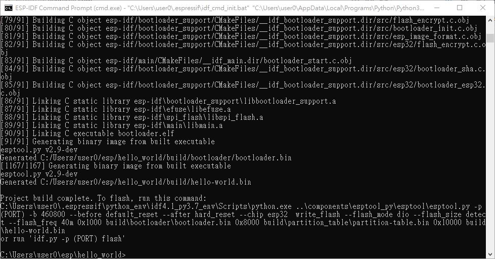

### win10, install the ESP-IDF tool for compilation  2020-SEP-26  
read this https://docs.espressif.com/projects/esp-idf/en/latest/esp32/get-started/windows-setup.html  
~~download, https://dl.espressif.com/dl/esp-idf-tools-setup-2.3.exe, run this installer, default esp-idf v4.1 release~~  

2021-JUN-04, download, https://dl.espressif.com/dl/esp-idf-tools-setup-online-2.8.exe, run this installer, default esp-idf v4.2 release 


python 3.7, Git, Powershell and or some other tools will be installed inherently  


~~latest tool verison, esp-idf-v3.3.4, https://github.com/espressif/esp-idf/releases~~  

how to update the tool, https://docs.espressif.com/projects/esp-idf/en/latest/esp32/get-started/windows-setup-update.html  


### hello_world build, ok
https://docs.espressif.com/projects/esp-idf/en/latest/esp32/get-started/index.html#get-started-set-up-tools

```  
mkdir %userprofile%\esp  
cd %userprofile%\esp  
install.bat
export.bat
xcopy /e /i %IDF_PATH%\examples\get-started\hello_world hello_world   
cd %userprofile%\esp\hello_world  
idf.py set-target esp32  
idf.py menuconfig  
idf.py menuconfig  
idf.py build  


```

build hello_world, successed

  


### build ESP32_MP3_Decoder, no good ?!
open esp-idf command line   
```
git submodule update --init
```


clone the source code  

```
mkdir %userprofile%\esp  
cd %userprofile%\esp  
git clone https://github.com/xiaolaba/ESP32_MP3_Decoder  

```
brrow CMakeLists.txt from hello_world (https://docs.espressif.com/projects/esp-idf/en/latest/esp32/api-reference/kconfig.html)

change to source code director  
```  
cd %userprofile%\esp\ESP32_MP3_Decoder

```  


```
idf.py set-target esp32  
idf.py menuconfig
```

Enable Classic Bluetooth in Component config > Bluetooth > Bluedroid Bluetooth stack enabled > Classic Bluetooth, 
then enable Bluetooth Speaker Mode via make menuconfig. 
After flashing, you should see a Bluetooth device called "ESP_SPEAKER". 
If you don't like that name, you can change it via menuconfig.


```
git submodule init && git submodule update
```

build
```  
idf.py build
```  

build full clean
```  
idf.py fullclean
```  

build tool help
```  
idf.py -h
```  


### build Failed, log, but why ?

```
C:\Users\user0\esp\ESP32_MP3_Decoder>idf.py build
Executing action: all (aliases: build)
Running ninja in directory c:\users\user0\esp\esp32_mp3_decoder\build
Executing "ninja all"...
[0/1] Re-running CMake...
-- ccache will be used for faster recompilation
-- Project version: 1f426c9
-- Building ESP-IDF components for target esp32
Loading defaults file C:/Users/user0/esp/ESP32_MP3_Decoder/sdkconfig.defaults...
C:\Users\user0\AppData\Local\Temp\confgen_tmpsz_q0roi:11: warning: ignoring malformed line 'FREERTOS_ASSERT_ON_UNTESTED_FUNCTION=n'
-- Could NOT find Perl (missing: PERL_EXECUTABLE)
-- Adding linker script C:/Users/user0/esp/ESP32_MP3_Decoder/build/esp-idf/esp32/esp32_out.ld
-- Adding linker script C:/Users/user0/esp/components/esp32/ld/esp32.project.ld.in
-- Adding linker script C:/Users/user0/esp/components/esp32/ld/esp32.peripherals.ld
-- Adding linker script C:/Users/user0/esp/components/esp_rom/esp32/ld/esp32.rom.newlib-time.ld
-- Adding linker script C:/Users/user0/esp/components/esp_rom/esp32/ld/esp32.rom.ld
-- Adding linker script C:/Users/user0/esp/components/esp_rom/esp32/ld/esp32.rom.libgcc.ld
-- Adding linker script C:/Users/user0/esp/components/esp_rom/esp32/ld/esp32.rom.newlib-data.ld
-- Adding linker script C:/Users/user0/esp/components/esp_rom/esp32/ld/esp32.rom.syscalls.ld
-- Adding linker script C:/Users/user0/esp/components/esp_rom/esp32/ld/esp32.rom.newlib-funcs.ld
-- Components: app_trace app_update asio bootloader bootloader_support bt cbor coap console cxx driver efuse esp-tls esp32 esp_adc_cal esp_common esp_eth esp_event esp_gdbstub esp_http_client esp_http_server esp_https_ota esp_https_server esp_local_ctrl esp_netif esp_ringbuf esp_rom esp_serial_slave_link esp_websocket_client esp_wifi espcoredump esptool_py expat fatfs freemodbus freertos heap idf_test jsmn json libsodium log lwip mbedtls mdns mqtt newlib nghttp nvs_flash openssl partition_table perfmon protobuf-c protocomm pthread sdmmc soc spi_flash spiffs tcp_transport tcpip_adapter ulp unity vfs wear_levelling wifi_provisioning wpa_supplicant xtensa
-- Component paths: C:/Users/user0/esp/components/app_trace C:/Users/user0/esp/components/app_update C:/Users/user0/esp/components/asio C:/Users/user0/esp/components/bootloader C:/Users/user0/esp/components/bootloader_support C:/Users/user0/esp/components/bt C:/Users/user0/esp/components/cbor C:/Users/user0/esp/components/coap C:/Users/user0/esp/components/console C:/Users/user0/esp/components/cxx C:/Users/user0/esp/components/driver C:/Users/user0/esp/components/efuse C:/Users/user0/esp/components/esp-tls C:/Users/user0/esp/components/esp32 C:/Users/user0/esp/components/esp_adc_cal C:/Users/user0/esp/components/esp_common C:/Users/user0/esp/components/esp_eth C:/Users/user0/esp/components/esp_event C:/Users/user0/esp/components/esp_gdbstub C:/Users/user0/esp/components/esp_http_client C:/Users/user0/esp/components/esp_http_server C:/Users/user0/esp/components/esp_https_ota C:/Users/user0/esp/components/esp_https_server C:/Users/user0/esp/components/esp_local_ctrl C:/Users/user0/esp/components/esp_netif C:/Users/user0/esp/components/esp_ringbuf C:/Users/user0/esp/components/esp_rom C:/Users/user0/esp/components/esp_serial_slave_link C:/Users/user0/esp/components/esp_websocket_client C:/Users/user0/esp/components/esp_wifi C:/Users/user0/esp/components/espcoredump C:/Users/user0/esp/components/esptool_py C:/Users/user0/esp/components/expat C:/Users/user0/esp/components/fatfs C:/Users/user0/esp/components/freemodbus C:/Users/user0/esp/components/freertos C:/Users/user0/esp/components/heap C:/Users/user0/esp/components/idf_test C:/Users/user0/esp/components/jsmn C:/Users/user0/esp/components/json C:/Users/user0/esp/components/libsodium C:/Users/user0/esp/components/log C:/Users/user0/esp/components/lwip C:/Users/user0/esp/components/mbedtls C:/Users/user0/esp/components/mdns C:/Users/user0/esp/components/mqtt C:/Users/user0/esp/components/newlib C:/Users/user0/esp/components/nghttp C:/Users/user0/esp/components/nvs_flash C:/Users/user0/esp/components/openssl C:/Users/user0/esp/components/partition_table C:/Users/user0/esp/components/perfmon C:/Users/user0/esp/components/protobuf-c C:/Users/user0/esp/components/protocomm C:/Users/user0/esp/components/pthread C:/Users/user0/esp/components/sdmmc C:/Users/user0/esp/components/soc C:/Users/user0/esp/components/spi_flash C:/Users/user0/esp/components/spiffs C:/Users/user0/esp/components/tcp_transport C:/Users/user0/esp/components/tcpip_adapter C:/Users/user0/esp/components/ulp C:/Users/user0/esp/components/unity C:/Users/user0/esp/components/vfs C:/Users/user0/esp/components/wear_levelling C:/Users/user0/esp/components/wifi_provisioning C:/Users/user0/esp/components/wpa_supplicant C:/Users/user0/esp/components/xtensa
-- Configuring done
-- Generating done
-- Build files have been written to: C:/Users/user0/esp/ESP32_MP3_Decoder/build
[15/1161] cmd.exe /C "cd /D C:\Users\user0\esp\ESP32_MP3_Decoder\bu...******************************************************************"
Partition table binary generated. Contents:
*******************************************************************************
# Espressif ESP32 Partition Table
# Name, Type, SubType, Offset, Size, Flags
nvs,data,nvs,0x9000,24K,
phy_init,data,phy,0xf000,4K,
factory,app,factory,0x10000,2M,
*******************************************************************************
[120/1161] Performing configure step for 'bootloader'
-- Found Git: C:/Program Files/Git/cmd/git.exe (found version "2.21.0.windows.1")
-- The C compiler identification is GNU 8.2.0
-- The CXX compiler identification is GNU 8.2.0
-- The ASM compiler identification is GNU
-- Found assembler: C:/Users/user0/.espressif/tools/xtensa-esp32-elf/esp-2020r2-8.2.0/xtensa-esp32-elf/bin/xtensa-esp32-elf-gcc.exe
-- Check for working C compiler: C:/Users/user0/.espressif/tools/xtensa-esp32-elf/esp-2020r2-8.2.0/xtensa-esp32-elf/bin/xtensa-esp32-elf-gcc.exe
-- Check for working C compiler: C:/Users/user0/.espressif/tools/xtensa-esp32-elf/esp-2020r2-8.2.0/xtensa-esp32-elf/bin/xtensa-esp32-elf-gcc.exe -- works
-- Detecting C compiler ABI info
-- Detecting C compiler ABI info - done
-- Detecting C compile features
-- Detecting C compile features - done
-- Check for working CXX compiler: C:/Users/user0/.espressif/tools/xtensa-esp32-elf/esp-2020r2-8.2.0/xtensa-esp32-elf/bin/xtensa-esp32-elf-g++.exe
-- Check for working CXX compiler: C:/Users/user0/.espressif/tools/xtensa-esp32-elf/esp-2020r2-8.2.0/xtensa-esp32-elf/bin/xtensa-esp32-elf-g++.exe -- works
-- Detecting CXX compiler ABI info
-- Detecting CXX compiler ABI info - done
-- Detecting CXX compile features
-- Detecting CXX compile features - done
-- Project version: v4.1-dirty
-- Building ESP-IDF components for target esp32
-- Adding linker script C:/Users/user0/esp/components/esp32/ld/esp32.peripherals.ld
-- Adding linker script C:/Users/user0/esp/components/esp_rom/esp32/ld/esp32.rom.ld
-- Adding linker script C:/Users/user0/esp/components/esp_rom/esp32/ld/esp32.rom.newlib-funcs.ld
-- Adding linker script C:/Users/user0/esp/components/esp_rom/esp32/ld/esp32.rom.libgcc.ld
-- Adding linker script C:/Users/user0/esp/components/bootloader/subproject/main/ld/esp32/bootloader.ld
-- Adding linker script C:/Users/user0/esp/components/bootloader/subproject/main/ld/esp32/bootloader.rom.ld
-- Components: bootloader bootloader_support efuse esp32 esp_common esp_rom esptool_py log main micro-ecc partition_table soc spi_flash xtensa
-- Component paths: C:/Users/user0/esp/components/bootloader C:/Users/user0/esp/components/bootloader_support C:/Users/user0/esp/components/efuse C:/Users/user0/esp/components/esp32 C:/Users/user0/esp/components/esp_common C:/Users/user0/esp/components/esp_rom C:/Users/user0/esp/components/esptool_py C:/Users/user0/esp/components/log C:/Users/user0/esp/components/bootloader/subproject/main C:/Users/user0/esp/components/bootloader/subproject/components/micro-ecc C:/Users/user0/esp/components/partition_table C:/Users/user0/esp/components/soc C:/Users/user0/esp/components/spi_flash C:/Users/user0/esp/components/xtensa
-- Configuring done
-- Generating done
-- Build files have been written to: C:/Users/user0/esp/ESP32_MP3_Decoder/build/bootloader
[158/1161] Performing build step for 'bootloader'
[1/91] Generating project_elf_src.c
[2/91] Building C object esp-idf/soc/CMakeFiles/__idf_soc.dir/esp32/adc_periph.c.obj
[3/91] Building C object esp-idf/soc/CMakeFiles/__idf_soc.dir/esp32/cpu_util.c.obj
[4/91] Building C object esp-idf/soc/CMakeFiles/__idf_soc.dir/esp32/dac_periph.c.obj
[5/91] Building C object esp-idf/soc/CMakeFiles/__idf_soc.dir/esp32/rtc_periph.c.obj
[6/91] Building C object esp-idf/soc/CMakeFiles/__idf_soc.dir/esp32/gpio_periph.c.obj
[7/91] Building C object esp-idf/soc/CMakeFiles/__idf_soc.dir/esp32/rtc_clk_init.c.obj
[8/91] Building C object esp-idf/soc/CMakeFiles/__idf_soc.dir/esp32/rtc_io_periph.c.obj
[9/91] Building C object esp-idf/soc/CMakeFiles/__idf_soc.dir/esp32/sdmmc_periph.c.obj
[10/91] Building C object esp-idf/soc/CMakeFiles/__idf_soc.dir/esp32/rtc_clk.c.obj
[11/91] Building C object esp-idf/soc/CMakeFiles/__idf_soc.dir/esp32/sdio_slave_periph.c.obj
[12/91] Building C object esp-idf/soc/CMakeFiles/__idf_soc.dir/esp32/rtc_init.c.obj
[13/91] Building C object esp-idf/soc/CMakeFiles/__idf_soc.dir/esp32/rtc_time.c.obj
[14/91] Building C object esp-idf/soc/CMakeFiles/__idf_soc.dir/esp32/rtc_pm.c.obj
[15/91] Building C object esp-idf/soc/CMakeFiles/__idf_soc.dir/esp32/interrupts.c.obj
[16/91] Building C object esp-idf/soc/CMakeFiles/__idf_soc.dir/esp32/i2s_periph.c.obj
[17/91] Building C object esp-idf/soc/CMakeFiles/__idf_soc.dir/esp32/i2c_periph.c.obj
[18/91] Building C object esp-idf/soc/CMakeFiles/__idf_soc.dir/esp32/rtc_wdt.c.obj
[19/91] Building C object esp-idf/soc/CMakeFiles/__idf_soc.dir/esp32/spi_periph.c.obj
[20/91] Building C object esp-idf/soc/CMakeFiles/__idf_soc.dir/esp32/soc_memory_layout.c.obj
[21/91] Building C object esp-idf/soc/CMakeFiles/__idf_soc.dir/esp32/ledc_periph.c.obj
[22/91] Building C object esp-idf/soc/CMakeFiles/__idf_soc.dir/esp32/uart_periph.c.obj
[23/91] Building C object esp-idf/soc/CMakeFiles/__idf_soc.dir/esp32/touch_sensor_hal.c.obj
[24/91] Building C object esp-idf/soc/CMakeFiles/__idf_soc.dir/esp32/rtc_sleep.c.obj
[25/91] Building C object esp-idf/soc/CMakeFiles/__idf_soc.dir/esp32/touch_sensor_periph.c.obj
[26/91] Building C object esp-idf/soc/CMakeFiles/__idf_soc.dir/src/hal/rtc_io_hal.c.obj
[27/91] Building C object esp-idf/soc/CMakeFiles/__idf_soc.dir/src/hal/rmt_hal.c.obj
[28/91] Building C object esp-idf/soc/CMakeFiles/__idf_soc.dir/src/memory_layout_utils.c.obj
[29/91] Building C object esp-idf/soc/CMakeFiles/__idf_soc.dir/src/lldesc.c.obj
[30/91] Building C object esp-idf/soc/CMakeFiles/__idf_soc.dir/src/hal/dac_hal.c.obj
[31/91] Building C object esp-idf/soc/CMakeFiles/__idf_soc.dir/src/hal/adc_hal.c.obj
[32/91] Building C object esp-idf/soc/CMakeFiles/__idf_soc.dir/src/hal/spi_hal.c.obj
[33/91] Building C object esp-idf/soc/CMakeFiles/__idf_soc.dir/src/hal/touch_sensor_hal.c.obj
[34/91] Building C object esp-idf/soc/CMakeFiles/__idf_soc.dir/src/hal/spi_slave_hal_iram.c.obj
[35/91] Building C object esp-idf/soc/CMakeFiles/__idf_soc.dir/src/hal/spi_hal_iram.c.obj
[36/91] Building C object esp-idf/soc/CMakeFiles/__idf_soc.dir/src/hal/ledc_hal.c.obj
[37/91] Building C object esp-idf/soc/CMakeFiles/__idf_soc.dir/src/hal/spi_slave_hal.c.obj
[38/91] Building C object esp-idf/soc/CMakeFiles/__idf_soc.dir/src/hal/sigmadelta_hal.c.obj
[39/91] Building C object esp-idf/soc/CMakeFiles/__idf_soc.dir/src/soc_include_legacy_warn.c.obj
[40/91] Building C object esp-idf/soc/CMakeFiles/__idf_soc.dir/src/hal/pcnt_hal.c.obj
[41/91] Building C object esp-idf/soc/CMakeFiles/__idf_soc.dir/src/hal/timer_hal.c.obj
[42/91] Building C object esp-idf/soc/CMakeFiles/__idf_soc.dir/src/hal/i2s_hal.c.obj
[43/91] Building C object esp-idf/soc/CMakeFiles/__idf_soc.dir/src/hal/uart_hal_iram.c.obj
[44/91] Building C object esp-idf/soc/CMakeFiles/__idf_soc.dir/src/hal/ledc_hal_iram.c.obj
[45/91] Building C object esp-idf/soc/CMakeFiles/__idf_soc.dir/src/hal/uart_hal.c.obj
[46/91] Building C object esp-idf/soc/CMakeFiles/__idf_soc.dir/src/hal/i2c_hal_iram.c.obj
[47/91] Building C object esp-idf/soc/CMakeFiles/__idf_soc.dir/src/hal/i2c_hal.c.obj
[48/91] Building C object esp-idf/soc/CMakeFiles/__idf_soc.dir/src/hal/gpio_hal.c.obj
[49/91] Building C object esp-idf/soc/CMakeFiles/__idf_soc.dir/src/hal/spi_flash_hal.c.obj
[50/91] Building C object esp-idf/soc/CMakeFiles/__idf_soc.dir/src/hal/spi_flash_hal_iram.c.obj
[51/91] Building C object esp-idf/soc/CMakeFiles/__idf_soc.dir/src/hal/can_hal.c.obj
[52/91] Building C object esp-idf/log/CMakeFiles/__idf_log.dir/log.c.obj
[53/91] Building C object esp-idf/soc/CMakeFiles/__idf_soc.dir/src/hal/mcpwm_hal.c.obj
[54/91] Building C object esp-idf/log/CMakeFiles/__idf_log.dir/log_buffers.c.obj
[55/91] Building C object esp-idf/log/CMakeFiles/__idf_log.dir/log_noos.c.obj
[56/91] Building C object esp-idf/soc/CMakeFiles/__idf_soc.dir/src/hal/sdio_slave_hal.c.obj
[57/91] Building C object esp-idf/efuse/CMakeFiles/__idf_efuse.dir/src/esp32/esp_efuse_fields.c.obj
[58/91] Building C object esp-idf/efuse/CMakeFiles/__idf_efuse.dir/src/esp32/esp_efuse_utility.c.obj
[59/91] Building C object esp-idf/efuse/CMakeFiles/__idf_efuse.dir/esp32/esp_efuse_table.c.obj
[60/91] Building C object esp-idf/spi_flash/CMakeFiles/__idf_spi_flash.dir/esp32/spi_flash_rom_patch.c.obj
[61/91] Building C object esp-idf/efuse/CMakeFiles/__idf_efuse.dir/src/esp32/esp_efuse_api.c.obj
[62/91] Linking C static library esp-idf\log\liblog.a
[63/91] Building C object esp-idf/efuse/CMakeFiles/__idf_efuse.dir/src/esp_efuse_fields.c.obj
[64/91] Building C object esp-idf/efuse/CMakeFiles/__idf_efuse.dir/src/esp_efuse_api.c.obj
[65/91] Building C object esp-idf/efuse/CMakeFiles/__idf_efuse.dir/src/esp_efuse_utility.c.obj
[66/91] Building C object esp-idf/bootloader_support/CMakeFiles/__idf_bootloader_support.dir/src/bootloader_clock.c.obj
[67/91] Building C object esp-idf/bootloader_support/CMakeFiles/__idf_bootloader_support.dir/src/bootloader_flash.c.obj
[68/91] Building C object esp-idf/micro-ecc/CMakeFiles/__idf_micro-ecc.dir/uECC_verify_antifault.c.obj
[69/91] Linking C static library esp-idf\soc\libsoc.a
[70/91] Building C object esp-idf/bootloader_support/CMakeFiles/__idf_bootloader_support.dir/src/bootloader_common.c.obj
[71/91] Building C object esp-idf/bootloader_support/CMakeFiles/__idf_bootloader_support.dir/src/flash_partitions.c.obj
[72/91] Building C object esp-idf/bootloader_support/CMakeFiles/__idf_bootloader_support.dir/src/flash_qio_mode.c.obj
[73/91] Building C object esp-idf/bootloader_support/CMakeFiles/__idf_bootloader_support.dir/src/bootloader_random.c.obj
[74/91] Building C object esp-idf/bootloader_support/CMakeFiles/__idf_bootloader_support.dir/src/bootloader_efuse_esp32.c.obj
[75/91] Building C object CMakeFiles/bootloader.elf.dir/project_elf_src.c.obj
[76/91] Building C object esp-idf/bootloader_support/CMakeFiles/__idf_bootloader_support.dir/src/bootloader_flash_config_esp32.c.obj
[77/91] Building C object esp-idf/bootloader_support/CMakeFiles/__idf_bootloader_support.dir/src/flash_encrypt.c.obj
[78/91] Building C object esp-idf/bootloader_support/CMakeFiles/__idf_bootloader_support.dir/src/bootloader_utility.c.obj
[79/91] Linking C static library esp-idf\micro-ecc\libmicro-ecc.a
[80/91] Building C object esp-idf/bootloader_support/CMakeFiles/__idf_bootloader_support.dir/src/esp32/bootloader_sha.c.obj
[81/91] Building C object esp-idf/bootloader_support/CMakeFiles/__idf_bootloader_support.dir/src/esp_image_format.c.obj
[82/91] Building C object esp-idf/main/CMakeFiles/__idf_main.dir/bootloader_start.c.obj
[83/91] Building C object esp-idf/bootloader_support/CMakeFiles/__idf_bootloader_support.dir/src/bootloader_init.c.obj
[84/91] Building C object esp-idf/bootloader_support/CMakeFiles/__idf_bootloader_support.dir/src/esp32/bootloader_esp32.c.obj
[85/91] Building C object esp-idf/bootloader_support/CMakeFiles/__idf_bootloader_support.dir/src/esp32/flash_encrypt.c.obj
[86/91] Linking C static library esp-idf\bootloader_support\libbootloader_support.a
[87/91] Linking C static library esp-idf\efuse\libefuse.a
[88/91] Linking C static library esp-idf\spi_flash\libspi_flash.a
[89/91] Linking C static library esp-idf\main\libmain.a
[90/91] Linking C executable bootloader.elf
[91/91] Generating binary image from built executable
esptool.py v2.9-dev
Generated C:/Users/user0/esp/ESP32_MP3_Decoder/build/bootloader/bootloader.bin
[1160/1161] Linking CXX executable ESP32_MP3_Decoder.elf
FAILED: ESP32_MP3_Decoder.elf
cmd.exe /C "cd . && C:\Users\user0\.espressif\tools\xtensa-esp32-elf\esp-2020r2-8.2.0\xtensa-esp32-elf\bin\xtensa-esp32-elf-g++.exe  -mlongcalls -Wno-frame-address   @CMakeFiles\ESP32_MP3_Decoder.elf.rsp  -o ESP32_MP3_Decoder.elf  && cd ."
c:/users/user0/.espressif/tools/xtensa-esp32-elf/esp-2020r2-8.2.0/xtensa-esp32-elf/bin/../lib/gcc/xtensa-esp32-elf/8.2.0/../../../../xtensa-esp32-elf/bin/ld.exe: esp-idf/esp32/libesp32.a(cpu_start.c.obj):(.literal.main_task+0x18): undefined reference to `app_main'
c:/users/user0/.espressif/tools/xtensa-esp32-elf/esp-2020r2-8.2.0/xtensa-esp32-elf/bin/../lib/gcc/xtensa-esp32-elf/8.2.0/../../../../xtensa-esp32-elf/bin/ld.exe: esp-idf/esp32/libesp32.a(cpu_start.c.obj): in function `main_task':
C:/Users/user0/esp/components/esp32/cpu_start.c:551: undefined reference to `app_main'
collect2.exe: error: ld returned 1 exit status
ninja: build stopped: subcommand failed.
ninja failed with exit code 1

```


----------------------------------------------------------------------------------------------------------------------------------------
----------------------------------------------------------------------------------------------------------------------------------------


ESP32 Web Radio
=======================
This is a simple web radio streamer. It connects to a web radio station via wifi, decodes the stream and plays the sound via I2S codec or
to a speaker directly connected to the DAC pins.

Features:

* Decodes MP3 and AAC (Beta)
* Bluetooth Speaker mode

## Origin

This project is based on Sprite\_TM's awesome MP3 web radio project for the ESP8266: https://github.com/espressif/ESP8266_MP3_DECODER

## Required Software

Get the SDK:

    git clone https://github.com/espressif/esp-idf.git
    cd esp-idf
    git submodule update --init

Set the IDF_PATH environment variable, and point it to this directory.

    export IDF_PATH=/path/to/esp-idf

Download the toolchain from: https://github.com/espressif/esp-idf#setting-up-esp-idf
You will need version 5.2.0.
Add /path/to/xtensa-esp32-elf/bin to your PATH:

    export PATH=/path/to/xtensa-esp32-elf/bin:$PATH

## Configuration

The serial port and wifi credentials are configured using make.
Type `make menuconfig` and 

* configure your serial port in `Serial flasher config` submenu
* select `Web Radio / Bluetooth Speaker` submenu
  * configure wifi credentials
  * select audio output mode
  * activate / disable bt speaker mode
* 'save', then exit

You can edit the list of radio stations in the `/main/playlist.pls` playlist file.

## Building
If this is the first time, initialize the submodules:
`git submodule init && git submodule update`.
Then, just type `make`.

## Flashing
Connect your serial cable and run 'make flash'. To see serial console output run 'make monitor'.

## Controls
You can advance to the next track in the playlist using the "Boot" button that is present on most development boards (GPIO0).

## UI
You can connect a <a href="https://www.adafruit.com/product/1312">NeoPixel</a> LED to pin 32. Its currently not doing much except blinking while wifi is connecting.

## Bluetooth Speaker Mode

Enable `Classic Bluetooth` in `Component config > Bluetooth > Bluedroid Bluetooth stack enabled > Classic Bluetooth`, then enable `Bluetooth Speaker Mode` via `make menuconfig`. After flashing, you should see a Bluetooth device called "ESP_SPEAKER". If you don't like that name, you can change it via menuconfig.

## Connecting the I2S codec

If you don't know about the I2S standard, it is a special protocol for transferring digital audio data between chips, similar to I2C. There are many I2S chips you can choose from, the most important differences are:

1. Amplification: some chips only decode the audio to a low analog level, so you need a separate amp, but some also have a built-in amplifier. Most of these 2-in-1 chips are made for smartphones so their energy output is in the range of 2-4W, but some other ones made for domestic audio appliances can go a lot higher.
2. MCLK: this is a separate clock signal that sometimes needs to be a precise number in the MHz range that depends on the current sample rate, sometimes can be a single constant value ("asynchronous") independent of the current sample rate, and sometimes is not required at all. The ESP32 does not output a MCLK signal, so a chip that does not require MCLK is most convenient. If you already have an asynchronous one lying around (e.g. ES9023), you will need a quartz oscillator, usually in the range of 20-50MHz.

I tested several I2S codecs, and was happiest with the MAX98357A, because it does not require MCLCK and also amplifies the audio to speaker levels. It also seemed to be more immune to signal integrity issues, which do occur on breadboards. There is a convenient breakout board from Adafruit: https://www.adafruit.com/product/3006. Be aware that it is mono only, for stereo you'll want this one: https://www.adafruit.com/product/3346.
However, any I2S codec should work.

Generic wiring:

```
ESP pin   - I2S signal
----------------------
GPIO25/DAC1   - LRCK
GPIO26/DAC2   - BCLK
GPIO22        - DATA
```

If you're using the MAX98357A, connect GND to ground and Vin to +5V (or +3.3V if +5V is unavailable). SD can remain unconnected, and GAIN too unless you want to make it louder or lower. I also recommend using a potentiometer for volume regulation.

## Running without the I2S DAC

If you don't have an I2S codec on hand, there are two options:
- Built-In DAC (low quality)
- PDM (high quality)

Run `make menuconfig` and choose one of them in the `Audio Output Mode` menu, then re-flash.
You can now connect a speaker to ground and the pins 25 and 26 for the left and right channels.

## Known Issues

* Some AAC streams may not be playable

## More Information

There is a thread over at the ESP32 forum:
https://esp32.com/viewtopic.php?f=17&t=1026

## Related Hardware

If you're looking for a purpose-built board, check out the "ESP32 Audio Developing Board" from Microwavemont:
https://www.tindie.com/products/microwavemont/esp32-audio-developing-board-esp32-adb/

## Breadboard Example

I used the Watterott ESP-WROOM-32-Breakout, which is pin-compatible to the Espressif Core Board (DevKitC).
Please note that in this picture, the JTAG header is connected too, but you can safely ignore that.


